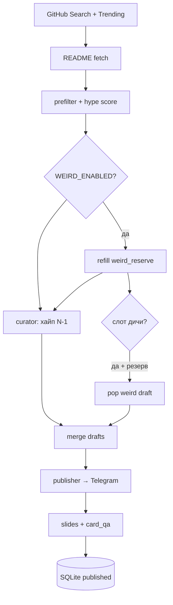

---
tags:
  - проект
  - telegram
  - github
  - automation
  - instagram
aliases:
  - zoloto-github
  - githubgold
  - treasure
status: active
repo: https://github.com/zobnin8-ux/githubgold
updated: 2026-06-26
---

# Золото GitHub

> Автопилот Telegram-канала про хайповые репозитории GitHub + коллекционные карточки Instagram.
> Репозиторий: `D:\treasure` · GitHub: [zobnin8-ux/githubgold](https://github.com/zobnin8-ux/githubgold)

## Быстрые ссылки

- [[#Пайплайн]] · [[#Рубрика Дичь]] · [[#Карточки]] · [[#QA]] · [[#Конфиг]] · [[#Команды бота]]
- Код: `github_radar/main.py`
- Конфиг: `.env` ← `.env.example`
- Лог: `data/radar.log`
- БД: `data/radar.sqlite`

---

## Пайплайн



### Ритм

- **9 хайп/день** — `POSTS_PER_RUN=3` × 3 запуска (каждые 8 ч)
- **1 дичь/день** — джокер из `weird_reserve`, не считается в лестнице редкости

### Инварианты текста

См. `github_radar/grounding.py`:

- Описание **только** из README + GitHub API description
- Запрещено додумывать из `owner/name`
- README < 200 символов → пропуск
- Claude вернул `{"unclear": true}` → пропуск
- `slide_body` ≤ **200** символов

---

## Рубрика «Дичь»

#дичь #джокер

| Параметр | Значение |
|----------|----------|
| Включение | `WEIRD_ENABLED=true` |
| Квота | `WEIRD_PER_DAY=1` |
| Резерв | `weird_reserve` в SQLite, цель `WEIRD_RESERVE_TARGET=10` |
| Поиск | `WEIRD_TOPICS` — без фильтра свежести |
| Судья | Claude + mechanical score |
| Визуал | **обязателен** — `pick_weird_screenshot()`, плашка запрещена |
| NSFW | лёгкий фильтр в `grounding.is_nsfw_or_offensive` |

### Слот в прогоне

```
если weird_posted_today < WEIRD_PER_DAY и резерв не пуст:
  hype_count = POSTS_PER_RUN - 1
  + 1 дичь из резерва (FIFO, skip без визуала)
иначе:
  hype_count = POSTS_PER_RUN
```

### Скрипты

```powershell
python scripts/seed_weird.py          # предзагрузка резерва
python scripts/render_weird_sample.py   # сэмпл карты → _samples/
```

### Карта-джокер

- Бейдж: **★ ДИЧЬ** — заливка `#FF3D9A`, белый текст, наклон −6°
- Акцент: розовый вместо золотого/фиолетового
- Фон/рамка/лого — как у коллекции

---

## Telegram: карточки vs классика

#telegram #карточки

| Режим | Env | Что уходит в канал |
|-------|-----|-------------------|
| **Карточка (default)** | `TELEGRAM_CARD_MODE=true` | PNG 1080×1350 через Playwright + CARD QA |
| Классика | `TELEGRAM_CARD_MODE=false` | Текст поста + README-скрин / OG |

- Прогресс-бар в админ-боте: фазы `CARD_PHASES` vs `PHASES` (`progress.py`)
- Legacy: `card_experiment.py` — старый A/B-счётчик; заменён на постоянный флаг

---

## Карточки

#instagram #карточки

### Форматы

| fmt | px | папка |
|-----|-----|-------|
| carousel | 1080×1350 | `data/instagram/carousel/` |
| reel | 1080×1920 | `data/instagram/reels/` |

### Блоки (минимализм)

1. Шапка — `Золото GitHub` + бейдж
2. Арт — скрин или плашка (только хайп)
3. `owner/repo` · имя · язык • лицензия
4. headline + body
5. ⭐ · 🍴 · ◎ issues
6. тэглайн + @github_gold

### Текст на карте

- JS `fitCardCopy()` в `templates/card.html`
- Ступенчато: body 44→36px, потом `…`
- Copy-зона изолирована от стат-бара (grid row)

### Модули

- `slides.py` — Playwright рендер
- `image_pick.py` — выбор скрина, `is_good_card_art`
- `card_qa.py` — QA до сохранения

---

## QA

#qa

Каждая карточка **до сохранения PNG**:

| # | Проверка |
|---|----------|
| 1 | PNG ровно 1080×1350 / 1080×1920 |
| 2 | Текст влезает, gap до стат-бара ≥ 10px |
| 3 | Арт: screenshot / plaque / missing |
| 4 | Дичь → только screenshot |
| 5 | Статы = GitHub API |
| 6 | README ≥ 200 символов |
| 7 | Дедуп — не опубликован ранее |

Dry-run вывод:

```
--- CARD QA ---
  QA [OK] owner/repo (carousel) | PNG 1080×1350 | текст да @42px | арт screenshot | статы да
```

Брак → `CardQAError`, PNG удаляется.

---

## Конфиг

#config

### Секреты

```
TELEGRAM_BOT_TOKEN
TELEGRAM_CHANNEL_ID
TELEGRAM_ADMIN_USER_ID
GITHUB_TOKEN
ANTHROPIC_API_KEY
```

### Дичь

```
WEIRD_ENABLED=true
WEIRD_PER_DAY=1
WEIRD_RESERVE_TARGET=10
WEIRD_ACCENT=#FF3D9A
WEIRD_BADGE=ДИЧЬ
WEIRD_TOPICS=fun,joke,useless,...
```

### Карточки

```
MAKE_SLIDES=true
SLIDE_FORMATS=carousel,reels
SLIDE_DIR=./data/instagram
TIMEZONE=Europe/Moscow
```

---

## Команды бота

#бот

| Команда | Что делает |
|---------|------------|
| `/run` | Боевой цикл |
| `/dry` | Dry-run + CARD QA |
| `/stop` | Только бот |
| `/stopall` | main + все боты + lock-файлы |
| `/status` | Прогресс, посты сегодня |
| `/today` | Список за сегодня |
| `/stats` | Всего в БД |

Lock-файлы: `data/radar.lock`, `data/cycle.lock`, `data/bot.launch.lock`

---

## Структура кода

```
github_radar/
├── main.py           # цикл, dry-run, weird slot
├── curator.py        # хайп, Claude
├── weird.py          # дичь, резерв, pop/peek
├── grounding.py      # README-only правила
├── card_qa.py        # QA gate
├── storage.py        # published + weird_reserve
├── slides.py         # рендер
├── image_pick.py     # скрины
└── admin_bot.py      # Telegram UI
```

---

## Чеклист перед релизом

- [ ] `python -m github_radar.main --dry-run` — CARD QA 100%
- [ ] `python scripts/preview_grounded_posts.py` — тексты vs README
- [ ] `python scripts/render_weird_sample.py` — джокер со скрином
- [ ] `python scripts/diagnose.py` — все зелёное
- [ ] Нет дублей ботов (`/stopall`)

---

## История / заметки

- **2026-06** — рубрика «Дичь», грунтинг README, card QA, упрощённые карточки
- **Проблема ButtFish** — Claude выдумывал из названия; решено `grounding.py` + перегенерация при pop из резерва
- **hypermind** — эталон дичи: P2P-счётчик, реальный скрин Active Nodes

---

## Связанные заметки

- [[README]] — публичная документация репозитория
- Теги: #золото-github #cursor #claude #playwright
